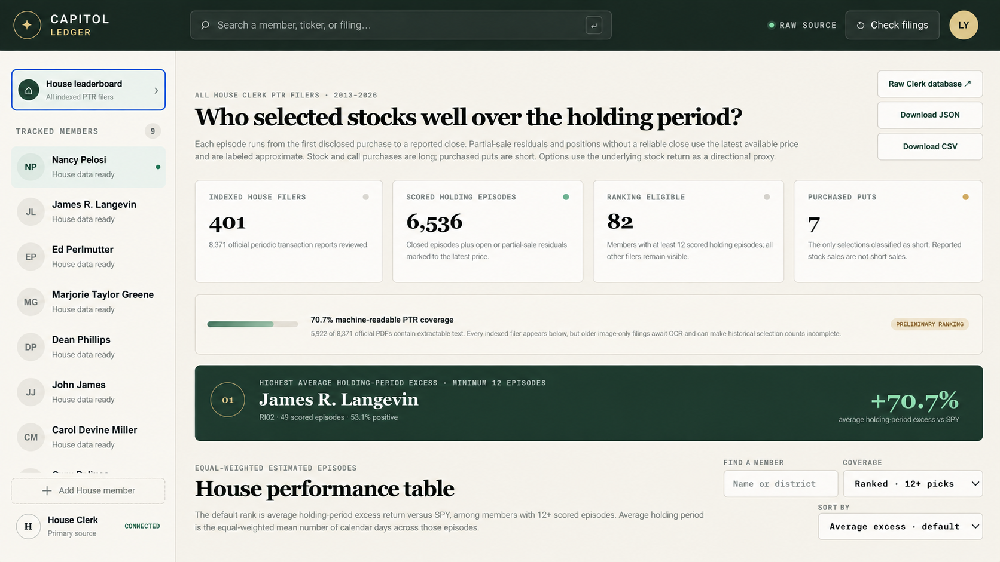

# Capitol Ledger

Capitol Ledger is a raw-source-first look at stock selections disclosed by members of the U.S. House. It starts with the House Clerk’s own indexes and PTR documents, reconstructs approximate holding episodes, and turns the result into a small research dashboard.

Some of the data collection, analysis, and website work was done with Codex. The judgment calls, caveats, and occasional raised eyebrow remain very human.

**Explore the details:** [capitol-ledger.yeefangxu.chatgpt.site](https://capitol-ledger.yeefangxu.chatgpt.site/)

The hosted tracker is link-accessible and uses the platform’s built-in Sign in with ChatGPT flow before showing the dashboard.

[](https://capitol-ledger.yeefangxu.chatgpt.site/)

## Two halves of the project

### 1. Data collection and analysis

The pipeline lives in [`scripts/`](scripts/) and produces the structured files in [`public/data/`](public/data/). It:

- downloads the official annual House Clerk filing indexes;
- reads the original Periodic Transaction Report PDFs;
- normalizes single-name stock and option transactions;
- reconstructs purchase-to-exit holding episodes;
- marks unresolved or partially sold positions to the latest available price;
- calculates directional return, SPY return, excess return, positive rate, and holding period; and
- saves reusable JSON and CSV outputs.

The full walk-through is in [docs/DATA_PIPELINE.md](docs/DATA_PIPELINE.md).

### 2. The Capitol Ledger tracker

The application lives mainly in [`app/`](app/), with persistent watchlists and alert rules defined in [`db/`](db/) and [`drizzle/`](drizzle/). It includes the House leaderboard and detailed member views for positions, performance episodes, transactions, alerts, and methodology.

The application map is in [docs/TRACKER.md](docs/TRACKER.md).

## Run it

You will need Node.js 22.13 or newer and `pdftotext` for a fresh data rebuild.

```bash
npm install
npm run data:refresh
npm run data:verify
npm run dev
```

For a production check:

```bash
npm run check
```

The first data refresh downloads thousands of official filings. Later runs reuse the ignored `work/` cache, because repeatedly downloading the same government PDFs is not a personality trait.

## Sources and important caveats

The primary sources are the [House Clerk financial-disclosure search](https://disclosures-clerk.house.gov/FinancialDisclosure/ViewSearch), annual ZIP indexes, and original PTR PDFs. Market returns use adjusted daily prices as a separate analytical input.

This is informational research—not investment, legal, tax, or personalized financial advice. It is not an exact brokerage ledger. Congressional disclosures usually provide value bands rather than exact amounts, omit cost basis, and can arrive weeks after the transaction. Modeled returns are estimates, options are measured using the underlying stock direction when reliable historical option prices are unavailable, and open positions mean “no machine-readable full exit was matched,” not “we have peeked inside the brokerage account.” Verify the original filings before relying on any result.

## Reuse, updates, and collaboration

Please feel free to use this project at your own convenience under the MIT License. I would gently advise against reinventing the filing-parser wheel unless wrestling with PDF tables is how you relax—but forks, experiments, corrections, and better ideas are very welcome.

The website will be updated irregularly, at the author’s convenience. No solemn refresh-calendar oaths here. If you spot a questionable record or want to collaborate on an improvement, please open an issue or pull request. Happy to work together on sensible changes, delightfully odd changes, and especially changes that make the methodology more honest.
